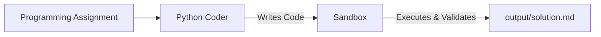

# Python Coder

A simple single-agent coding assistant built with CrewAI. Give it a programming assignment, and the agent writes Python code, executes it inside a sandboxed environment, validates the output, and generates a solution summary.

## How It Works

The crew consists of a single coding task executed sequentially.

1. Receive a programming assignment.
2. Generate Python code.
3. Write the code to the sandbox directory.
4. Execute the program in docker environment.
5. Verify the output.
6. Generate a summary in `output/solution.md`.

## Agent

This crew has **1 agent** and **1 task**.

| Agent | Role | What it does |
|-------|------|--------------|
| **Coder** | Python Developer | Generates Python code, executes it inside a sandbox, validates the result, and summarizes the solution. |

The agent uses **`openai/gpt-4o-mini`** by default (configured in `src/coder/config/agents.yaml`).

## Task

| Task | Agent | Output | Description |
|------|-------|--------|-------------|
| `coding_task` | Coder | `output/solution.md` | Solve the given programming assignment by writing and executing Python code inside the sandbox. |

## Default Workflow

The application runs with a predefined assignment:

> Write a Python program to calculate the first 1,000,000 terms of the series:
>
> `1 - 1/3 + 1/5 - 1/7 + ...`
>
> Multiply the final result by 4.

The crew then:

- Generates the Python solution.
- Executes the program in the sandbox.
- Verifies the output.
- Produces a solution summary in `output/solution.md`.

## Customization Ideas

- Support multiple programming languages.
- Add a reviewer agent to validate code quality and performance.
- Generate unit tests automatically.
- Enable iterative debugging when execution fails.

## License

Part of the AI_LEARNINGS learning repository.