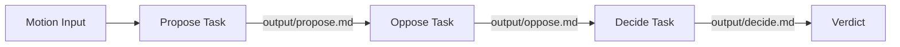

# Debate Crew

A multi-agent debate simulator built with [CrewAI](https://docs.crewai.com). Give it a motion — a debatable proposition — and two AI debaters will argue for and against it. An impartial judge then reviews both sides and declares a winner based purely on the strength of the arguments.

This project lives inside the [AI_LEARNINGS](../../) workspace and is a hands-on example of orchestrating collaborative AI agents with YAML-driven configuration.

## How It Works

The crew runs three tasks in **sequential** order. Each task's output becomes context for the next, so the opposition can respond to the proposition and the judge can weigh both arguments.

1. **Propose** — A debater builds the strongest possible case *in favor* of the motion.
2. **Oppose** — The same debater agent argues *against* the motion, with the proposition already on the table.
3. **Decide** — A judge agent reads both arguments and picks the more convincing side, explaining why.

## Agents

This crew has **2 agents** and **3 tasks**.

| Agent | Role | What it does |
|-------|------|--------------|
| **Debater** | A compelling debater | Crafts concise, persuasive arguments. Used for both the proposition and opposition tasks — first arguing *for* the motion, then *against* it. |
| **Judge** | Impartial adjudicator | Reviews both sides without personal bias and decides which argument is more convincing based on merit alone. |

Both agents use `openai/gpt-4o-mini` by default (configured in `src/debate/config/agents.yaml`).

## Tasks

| Task | Agent | Output | Description |
|------|-------|--------|-------------|
| `propose` | Debater | `output/propose.md` | Argue in favor of the motion |
| `oppose` | Debater | `output/oppose.md` | Argue against the motion |
| `decide` | Judge | `output/decide.md` | Review both arguments and declare a winner |

## Default Motion

Out of the box, the crew debates:

> *Should social media platforms legally ban users under the age of 16 to protect mental health?*

You can change this by editing the `motion` input in `src/debate/main.py`.

## Customization Ideas

- **Swap the model** — Change `model` in `agents.yaml` to use a different LLM (e.g. `openai/gpt-4o`, `anthropic/claude-sonnet-4-20250514`).
- **Add research tools** — Wire up `SerperDevTool` or similar on the debater agent so arguments are grounded in real data.
- **Add more rounds** — Introduce rebuttal tasks where each side responds to the other's points.
- **Structured verdicts** — Use `output_pydantic` on the decide task to return a typed verdict object.
- **Knowledge sources** — Drop domain documents into `knowledge/` and attach them to agents for topic-specific debates.

## License

Part of the AI_LEARNINGS learning repository.
