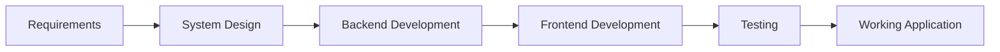

# Engineering Team

A multi-agent software engineering system built with **CrewAI**. Give it a set of software requirements, and the crew collaboratively designs, implements, tests, and validates a working solution.

## How It Works

The crew completes the software development process in **sequential** stages:

1. **Design** — The Engineering Lead analyzes the requirements and creates a detailed implementation plan.
2. **Backend Development** — The Backend Engineer implements the Python backend based on the design.
3. **Frontend Development** — The Frontend Engineer builds a Gradio interface to demonstrate the backend.
4. **Testing** — The Test Engineer writes unit tests, fixes issues if needed, and ensures everything works correctly.

## Agents

This crew has **4 agents** and **4 tasks**.

| Agent                 | Role             | Responsibility                                                                              |
| --------------------- | ---------------- | ------------------------------------------------------------------------------------------- |
| **Engineering Lead**  | System Designer  | Creates the system design, defines modules, APIs, and assigns work to the engineering team. |
| **Backend Engineer**  | Python Developer | Implements the backend using the Python standard library.                                   |
| **Frontend Engineer** | Gradio Developer | Builds a polished Gradio UI to demonstrate the backend functionality.                       |
| **Test Engineer**     | QA Engineer      | Writes unit tests, validates the backend, and ensures all tests pass.                       |

## Tasks

| Task            | Agent             | Output                                   |
| --------------- | ----------------- | ---------------------------------------- |
| `design_task`   | Engineering Lead  | `sandbox/design.md`                      |
| `code_task`     | Backend Engineer  | Backend implementation                   |
| `frontend_task` | Frontend Engineer | `sandbox/app.py` and validation script   |
| `test_task`     | Test Engineer     | Unit tests and `sandbox/test_summary.md` |

## Default Workflow

The application runs with a predefined requirements.

The crew then:

* Designs the solution architecture.
* Implements the backend.
* Builds a Gradio frontend.
* Writes and runs unit tests.
* Produces the completed application in the `sandbox/` directory.

## Customization Ideas

* Add specialized engineers (Database, DevOps, Security, Documentation).
* Optimize prompts to improve solution quality.
* Evaluate using cheaper models instead of GPT-5.5 for suitable agents to reduce inference costs while maintaining performance.

## License

Part of the **AI_LEARNINGS** learning repository.
