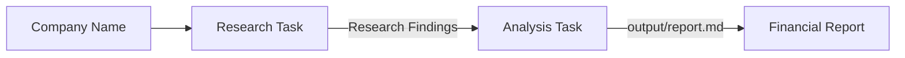

# Financial Researcher

A multi-agent financial research system built with [CrewAI](https://docs.crewai.com). Give it a company name, and the crew researches the business using recent web sources before producing a structured financial report with market insights.

## How It Works

The crew runs two tasks in **sequential** order. The researcher first gathers up-to-date information from the web, and the analyst then transforms those findings into a polished financial report.



1. **Research** — A financial researcher collects recent information about the company, including its business health, historical performance, news, opportunities, and future outlook.
2. **Analyze** — A market analyst reviews the research and produces a comprehensive report with an executive summary, key insights, and market outlook.

## Agents

This crew has **2 agents** and **2 tasks**.

| Agent          | Role                           | What it does                                                                                                                                                        |
| -------------- | ------------------------------ | ------------------------------------------------------------------------------------------------------------------------------------------------------------------- |
| **Researcher** | Senior Financial Researcher    | Performs web-based research on the target company, gathers recent news, evaluates company performance, and compiles structured research findings backed by sources. |
| **Analyst**    | Market Analyst & Report Writer | Reviews the research, identifies trends and key insights, and produces a professional financial report suitable for business analysis.                              |

Both agents use `openai/gpt-4o-mini` by default (configured in `src/financial_researcher/config/agents.yaml`).

## Tasks

| Task            | Agent      | Output                | Description                                                                                                                                          |
| --------------- | ---------- | --------------------- | ---------------------------------------------------------------------------------------------------------------------------------------------------- |
| `research_task` | Researcher | Context for next task | Research the company using recent web sources, covering company health, historical performance, news, challenges, opportunities, and future outlook. |
| `analysis_task` | Analyst    | `output/report.md`    | Convert the research into a comprehensive financial report with an executive summary and market analysis.                                            |

## Default Workflow

When the application starts, it prompts for a company name:

```text
Enter the company name for research:
```

For example:

> Apple

The crew then:

* Searches the web for recent information.
* Collects relevant financial and business insights.
* Analyzes the findings.
* Generates a professional report in `output/report.md`.

## Customization Ideas

* **Expand research scope** — Add specialized agents for competitor analysis, financial statement analysis, or macroeconomic research.
* **Investment scoring** — Introduce an additional task that evaluates company strengths, risks, and valuation using a predefined framework.
* **Knowledge sources** — Add annual reports, SEC filings, or internal research documents to the `knowledge/` directory for richer analysis.
* **Visualization** — Extend the analyst to generate charts and financial dashboards from collected data.

## License

Part of the AI_LEARNINGS learning repository.
