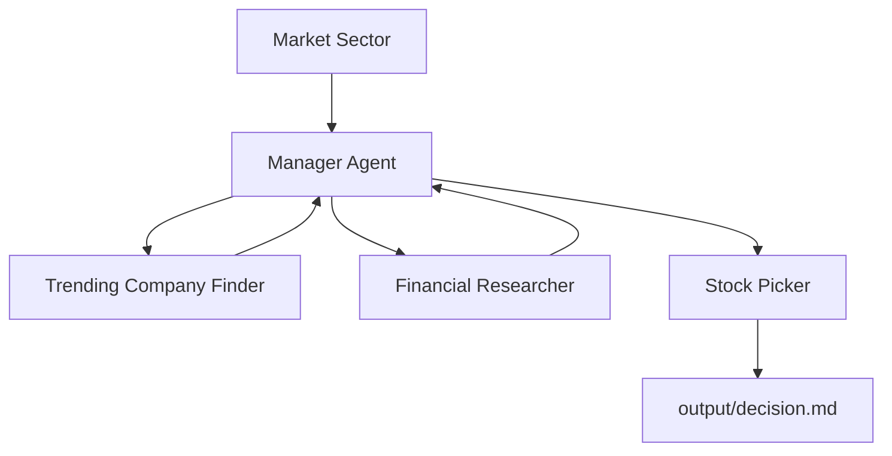

# Stock Picker

A multi-agent stock research system built with [CrewAI](https://docs.crewai.com). Give it a market sector, and the crew identifies trending companies, researches each one using recent web sources, and recommends the best investment opportunity.

## How It Works

The crew follows a **hierarchical** workflow managed by a CrewAI manager agent. Based on the user's input, the manager delegates work to specialized agents, reviews their outputs, and coordinates the final investment recommendation.

The manager agent coordinates three specialized agents:

1. **Trending Company Finder** — Identifies trending companies in the selected market sector.
2. **Financial Researcher** — Researches the shortlisted companies using recent financial and market information.
3. **Stock Picker** — Evaluates the research, selects the best investment opportunity, sends a push notification, and generates the final recommendation report.

## Customization Ideas

- **Portfolio recommendations** — Recommend multiple stocks instead of a single company.
- **Risk analysis** — Add an agent that evaluates investment risks and volatility.
- **Technical analysis** — Include price trends, moving averages, and momentum indicators.

## License

Part of the AI_LEARNINGS learning repository.